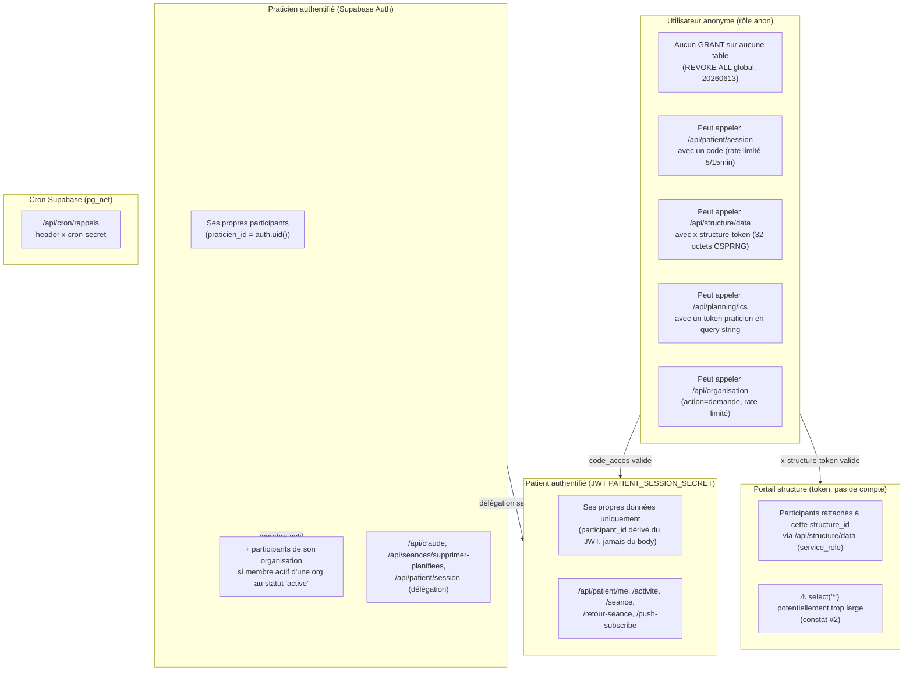

# Cartographie sécurité — Horizon (Mouv'APA)

**Méthode de production de ce document : analyse statique uniquement.**
Aucun accès direct à la base Supabase (staging ou prod) n'était disponible au
moment de la rédaction (pas de `supabase login`, pas de clé `service_role`
locale). L'état ci-dessous est reconstruit en lisant, dans l'ordre
chronologique, les 68 fichiers de `supabase/migrations/*.sql` + le fichier
`supabase/schema.sql` (marqué obsolète dans le repo lui-même, utilisé
seulement comme point de départ pour les tables "historiques" qui n'ont
jamais eu de migration versionnée).

**Tout ce qui est marqué `NON VÉRIFIÉ` doit être confirmé par une requête
live sur staging avant d'être considéré comme acquis** (voir Phase 1). Le
dossier `supabase/migrations/README.md` documente lui-même plusieurs cas où
une migration versionnée n'a **jamais été réellement appliquée en
production** (`documents_partages`, `get_praticien_structure()`) — preuve
que "le fichier existe dans le repo" ≠ "l'état existe en base".

---

## 0. Constats préliminaires (à confirmer en Phase 1, ne pas corriger ici)

Ces points sont déjà visibles depuis le code, sans avoir besoin d'une
requête live. Ils sont listés ici pour information — **aucune correction
n'a été appliquée à ce stade (Phase 0 = lecture seule)**.

| # | Constat | Gravité indicative | Preuve (fichier) |
|---|---|---|---|
| 1 | `code_acces` patient (connexion `/patient`) généré avec `Math.random()`, pas un CSPRNG | **Critique** | `src/utils/codeAcces.ts:17` |
| 2 | Portail structure (`GET /api/structure/data`) fait `select('*', bilans(*), programmes(*))` sur `participants` → expose potentiellement `code_acces`, `iban`, `bic`, `rgpd`, antécédents médicaux à un token structure, alors que `api/patient/me.ts` scope soigneusement ses colonnes | **Critique/Élevée** (à confirmer : quelles colonnes existent réellement en prod) | `api/structure/data.ts:35` |
| 3 | Token structure (`structures.token_acces`) sans expiration, sans rotation | **Élevée** (déjà identifié dans le prompt d'audit) | `supabase/migrations/20260604_structures.sql` |
| 4 | Policies fantômes `anon_read_seances`/`anon_read_planning`/`anon_read_exercices` (`TO anon USING true`) recréées par `20260620_consolidation_seances_patient.sql` **après** que `20260620_audit_securite_rls.sql` les ait supprimées le même jour (ordre lexicographique : `audit_...` < `consolidation_...`) — actuellement inertes uniquement parce que `REVOKE ALL ... FROM anon` (global) tient. Fragile : un futur `GRANT` sur ces 3 tables réactiverait un accès anonyme complet. | Faible (aujourd'hui) / risque latent | `20260620_consolidation_seances_patient.sql` lignes 67-69, 112-114, 163-165 |
| 5 | `audit_logs` n'a aucune policy UPDATE/DELETE (bien), mais rien n'empêche `service_role` de modifier/supprimer des lignes au niveau DB (RLS ne s'applique jamais à `service_role`) — la garantie "append-only" repose entièrement sur la discipline du code applicatif, pas sur un verrou DB (ex. trigger `BEFORE UPDATE OR DELETE`) | Moyenne | `supabase/migrations/20260613_audit_logs.sql` |
| 6 | `tm6_variantes` (catalogue de variantes de test, pas de donnée patient) n'a **aucun RLS activé** | Info (pas de donnée de santé dans cette table) | `supabase/migrations/20260701_tm6_variantes.sql` |
| 7 | `documents_partages` et la fonction `get_praticien_structure()` : migrations présentes dans le repo mais **le README du dossier migrations affirme explicitement qu'elles n'ont jamais été appliquées en prod**. État réel non vérifié. | NON VÉRIFIÉ | `supabase/migrations/README.md` §"Correctif" |
| 8 | `bilans_brouillons` : migration présente (`20260613_create_bilans_brouillons.sql`), statut "appliqué en prod" non confirmé au moment de la consolidation (13/06) | NON VÉRIFIÉ | `supabase/migrations/README.md` |
| 9 | Routes citées dans le prompt d'audit original (`api/patient/login.ts`, `api/patient/praticien-acces.ts`) n'existent plus : fusionnées en `api/patient/session.ts` (voir mapping §4) | Info (mise à jour du prompt) | `api/patient/session.ts:10` |

Le mode « organisation » (palier 1-5, migrations `20260714_*`) est une
**fonctionnalité intentionnelle** qui élargit volontairement le modèle
d'autorisation strict "praticien A ↔ praticien B totalement étanches" décrit
dans le prompt d'audit : deux praticiens membres actifs de la **même
organisation active** peuvent légitimement voir les mêmes bénéficiaires. Le
harnais de tests multi-tenant de la Phase 1 devra donc traiter ce cas comme
un accès **légitime**, pas comme une fuite — et vérifier séparément que
deux praticiens de **deux organisations différentes** (ou un praticien
libéral hors organisation) restent bien étanches.

---

## 1. Tables de `public`

Légende : ✅ confirmé par migration versionnée · ⚠️ NON VÉRIFIÉ (dépend d'un
état non versionné ou d'une application incertaine en prod) · — sans objet.

### 1.1 Tables "historiques" (créées avant le dossier migrations, base : `schema.sql`)

| Table | RLS | FORCE RLS | Policies | GRANT anon | GRANT authenticated | GRANT service_role | Rattachement praticien |
|---|---|---|---|---|---|---|---|
| `praticiens` | ✅ ON | ⚠️ NV | 4 (`praticiens_select/insert/update/delete`, USING `id = auth.uid()`) | Aucun (REVOKE global 20260613) | implicite (rôle par défaut) | implicite | `id` = auth.uid() lui-même |
| `participants` | ✅ ON | ⚠️ NV | 4 CRUD (`participants_*`, `praticien_id = auth.uid()`) + `orga_acces_participants` (additive, palier 3) | Aucun | implicite | implicite | `praticien_id` (ou `organisation_id` si membre actif) |
| `bilans` | ✅ ON | ⚠️ NV | 4 CRUD `praticien_id = auth.uid()` + `orga_acces_bilans` additive. **Anciennes policies `"Acces public bilans patient"` (`USING true`) supprimées par `20260620_audit_securite_rls.sql`** — à reconfirmer en live que le DROP a bien été exécuté en prod | Aucun | implicite | implicite | `praticien_id` direct + `participant_id`→org |
| `contrats` | ✅ ON | ⚠️ NV | 4 CRUD + `orga_acces_contrats` | Aucun | explicite (GRANT 20260623) | explicite | `praticien_id` |
| `seances` | ✅ ON | ⚠️ NV | 4 CRUD + `orga_acces_seances`. **`"Acces public seances patient"` (`USING true`) supprimée** — à reconfirmer en live | Aucun | implicite | implicite | `praticien_id` |
| `notes_seances` | ✅ ON | ⚠️ NV | 4 CRUD + `orga_acces_notes_seances` | Aucun | implicite | implicite | `praticien_id` |
| `programmes` | ✅ ON | ⚠️ NV | 4 CRUD + `orga_acces_programmes`. **`"Acces public programmes patient"` supprimée** — à reconfirmer. Ghost policy `anon_read_programmes` également supprimée par le même fichier | Aucun (après lockdown) | implicite | implicite | `praticien_id` |
| `zones_geographiques` | ✅ ON | ⚠️ NV | 4 CRUD `praticien_id = auth.uid()` | Aucun | implicite | implicite | `praticien_id` |
| `indisponibilites` | ✅ ON | ⚠️ NV | 4 CRUD | Aucun | implicite | implicite | `praticien_id` |
| `assistant_logs` | ✅ ON | ⚠️ NV | 3 (`al_select/insert/delete`, pas d'UPDATE) | Aucun | implicite | implicite | `praticien_id` |

### 1.2 Tables ajoutées par migration versionnée

| Table | RLS | Policies | GRANT | Rattachement |
|---|---|---|---|---|
| `comptes_rendus_seances` | ✅ ON | 4 CRUD `praticien_id = auth.uid()` + `orga_acces_comptes_rendus_seances` | implicite | `praticien_id` direct + org |
| `documents_patient` | ✅ ON | `praticien_gere_documents_patient` (FOR ALL, jointure `participant_id`→`participants.praticien_id`) + `orga_acces_documents_patient` | implicite | jointure `participant_id` |
| `documents_partages` | ⚠️ **NON VÉRIFIÉ — probablement inexistante en prod** (voir constat #7) | `praticien_gere_partages` + `structure_anon_read_documents_partages` (conditionnelle, DO $$ bloc) | — | `structure_id` |
| `factures_suivi` | ✅ ON | `praticien_gere_factures` (FOR ALL, `praticien_id = auth.uid()`) | implicite | `praticien_id` + `structure_id` |
| `structures` | ✅ ON | `praticien_gere_structures` (FOR ALL). `lecture_publique_token` (FOR SELECT, `actif=true`) créée puis **DROP explicite** dans `20260613_rls_anon_lockdown.sql` | Aucun (anon révoqué) | `praticien_id` |
| `structure_access_logs` | ✅ ON | `structure_access_logs_praticien_lecture` (lecture seule praticien, via jointure structures) | service_role (écriture) | jointure `structure_id`→`structures.praticien_id` |
| `bilans_brouillons` | ✅ ON (si appliquée — voir constat #8) | `own` | implicite | `praticien_id` (à confirmer nom colonne) |
| `programme_seances`, `programme_planning`, `programme_exercices` | ✅ ON | `praticien_crud_*` (jointure directe programme) + `praticien_gere_programme_*` (jointure double via participants) + `orga_acces_programme_*` (lot B, org) + **ghost `anon_read_*`** (constat #4) | authenticated + service_role explicites | jointure programme→participant |
| `seances_patient` | ✅ ON | `praticien_gere_seances_patient` + `praticien_voit_seances_patient` (jointure participant) + `orga_acces_seances_patient` (lot A). **Ex-faille `patient_gere_ses_seances` `USING(true)` corrigée** dans `20260620_consolidation_seances_patient.sql`/`20260620_audit_securite_rls.sql` — **à reconfirmer que la correction est bien appliquée en prod**, c'était la faille la plus critique trouvée dans l'historique de ce projet | authenticated + service_role | `participant_id`→`participants.praticien_id` (+org) |
| `exercices_realises` | ✅ ON | idem seances_patient (`patient_gere_ses_exercices` ex-faille corrigée) + `orga_acces_exercices_realises` (lot B, double jointure) | authenticated + service_role | jointure `seance_patient_id`→...→`praticien_id` |
| `push_subscriptions` | ✅ ON | `praticien_lit_push_subscriptions` (lecture seule) + `orga_lecture_push_subscriptions`. **Écriture réservée à `service_role`** (`api/patient/push-subscribe.ts`) | service_role write | `participant_id` |
| `rappel_preferences` | ✅ ON | `praticien_gere_rappel_preferences` (FOR ALL) | implicite | `praticien_id`/`participant_id` |
| `rappels_envoyes` | ✅ ON | `praticien_lit_rappels_envoyes` (lecture) + `orga_lecture_rappels_envoyes` | service_role write | `participant_id` |
| `retours_seance` | ✅ ON | `retours_seance_praticien_select` + `orga_lecture_retours_seance`. `praticien_id` nullable (FK SET NULL, mode organisation) | `service_role`: SELECT+INSERT / `authenticated`: SELECT | `participant_id` |
| `templates_structure` | ✅ ON | `praticien_gere_templates_structure` | implicite | `praticien_id` |
| `tests_etalons_activations` | ✅ ON | `tests_etalons_activations_praticien_all` + `orga_acces_tests_etalons_activations` | authenticated CRUD / service_role SELECT+INSERT | `participant_id` |
| `tests_etalons_resultats` | ✅ ON | `tests_etalons_resultats_praticien_select` (lecture seule) + `orga_lecture_tests_etalons_resultats` | authenticated SELECT / service_role SELECT+INSERT | `participant_id` |
| `exercices_libres_activations` | ✅ ON | `exercices_libres_activations_praticien_all` + `orga_acces_exercices_libres_activations` | authenticated CRUD / service_role SELECT+INSERT | `participant_id` |
| `exercices_libres_validations` | ✅ ON | `exercices_libres_validations_praticien_select` + `orga_lecture_exercices_libres_validations` | authenticated SELECT / service_role SELECT+INSERT+UPDATE | `participant_id` |
| `audit_logs` | ✅ ON | `audit_logs_praticien_lecture` (SELECT seule, via participant) + `orga_lecture_audit_logs`. **Aucune policy UPDATE/DELETE pour personne** (append-only au niveau RLS — mais pas au niveau `service_role`, voir constat #5) | service_role write only | `participant_id` (nullable) |
| `patient_login_attempts` | ✅ ON | **Aucune policy** — accessible seulement par `service_role` (RLS bloque tout le reste par défaut) | service_role only | — (pas de donnée patient, juste IP+date) |
| `organisations` | ✅ ON | `membres_lecture_organisations` (SELECT membres actifs) + `admins_maj_organisations` (UPDATE admins). Pas de policy INSERT publique — création via `service_role` (formulaire `POST /api/organisation`) | authenticated (lecture/maj scoped) | via `est_membre_organisation()`/`est_admin_organisation()` |
| `organisation_membres` | ✅ ON | `propre_ligne_organisation_membres` (SELECT soi-même) + `admins_lecture/ajout/maj_organisation_membres` | authenticated scoped | `user_id = auth.uid()` ou admin |
| `organisation_invitations` | ✅ ON | `admins_lecture_organisation_invitations` + `admins_creation_organisation_invitations` | authenticated (admins) | via `est_admin_organisation()` |
| `organisation_demande_attempts` | ✅ ON | **Aucune policy** — service_role only (rate limit formulaire public) | service_role only | — |
| `evenements_agenda` | ✅ ON | `evenements_agenda_select/insert/update/delete` (4 policies distinctes, à vérifier individuellement — non lues en détail dans cette passe) | ⚠️ NV | ⚠️ NV — à vérifier en Phase 1 |
| `dossiers_exercices` | ✅ ON | `praticien_gere_dossiers_exercices` | implicite | `praticien_id` |
| `exercices_personnalises` | ✅ ON | `praticien_gere_exercices_personnalises` | implicite | `praticien_id`. **Pas de policy `orga_acces_*`** — un salarié d'organisation ne voit pas la bibliothèque d'exercices personnalisés du praticien référent (à confirmer si intentionnel) |
| `dossier_exercice_membres` | ✅ ON | `praticien_gere_dossier_exercice_membres` | implicite | ⚠️ NV — colonne non lue en détail |
| `programmes_modeles` | ✅ ON | `praticien_gere_programmes_modeles` | authenticated + service_role CRUD | `praticien_id` |
| `programme_modele_seances/planning/exercices` | ✅ ON | `praticien_gere_modele_*` | authenticated + service_role CRUD | jointure vers `programmes_modeles.praticien_id` |
| `tm6_variantes` | ❌ **AUCUN RLS** | — | — | Table de référence (variantes de test), pas de colonne patient — pas de donnée de santé exposée directement, mais absence de RLS à corriger par hygiène |
| `patient_login_attempts`, `organisation_demande_attempts` | ✅ ON, 0 policy | — | service_role only | Tables techniques anti-abus, pas de donnée patient |

---

## 2. Vues

**Aucune vue (`CREATE VIEW`) trouvée** dans `supabase/migrations/` ni
`supabase/schema.sql`. Le vecteur "vue `SECURITY DEFINER` appartenant à
`postgres` qui court-circuite la RLS" mentionné dans le prompt d'audit ne
s'applique donc à aucun objet connu — **à confirmer en live** (une vue
pourrait avoir été créée directement via Supabase Studio sans migration,
comme cela s'est produit pour les tables "programme V2").

---

## 3. Fonctions SQL

| Fonction | SECURITY DEFINER | `search_path` figé | Rôle |
|---|---|---|---|
| `update_updated_at_column()` | Non (SQL simple) | — | Trigger générique |
| `set_praticien_id_from_auth()` | ✅ DEFINER | ❌ **non figé** (pas de `SET search_path`) | Auto-remplit `praticien_id` à l'INSERT — ancienne fonction (`schema.sql`), antérieure à la convention `search_path` |
| `structure_token_valide(uuid)` | ✅ DEFINER | ✅ `SET search_path = public` | Valide le header `x-structure-token` — **`GRANT ... TO anon` révoqué** par `20260613_rls_anon_lockdown.sql` (plus utilisée en pratique, portail structure passe par `service_role`) |
| `get_praticien_structure(text)` | ✅ DEFINER | ✅ | **Probablement jamais appliquée en prod** (constat #7) — `GRANT ... TO anon` présent dans son fichier de création |
| `acces_participant_pour(uuid, uuid)` | ✅ DEFINER | ✅ | Utilisée par `api/patient/session.ts` (accès délégué praticien→patient), `service_role` uniquement, `REVOKE ALL FROM PUBLIC, anon, authenticated` |
| `est_membre_organisation(uuid)` | ✅ DEFINER | ✅ | Teste appartenance active + `organisations.statut = 'active'` (corrigé par la migration `statut_securite`) |
| `est_admin_organisation(uuid)` | ✅ DEFINER | ✅ | Idem, rôle admin |
| `acces_participant(uuid)` | ✅ DEFINER | ✅ | Fonction centrale des policies additives `orga_acces_*` — `auth.uid()` NULL (anon) → toujours `false` |
| `dupliquer_programme_modele(uuid, uuid)` | **SECURITY INVOKER** (pas DEFINER) | ✅ | Seule fonction volontairement en INVOKER du lot — s'exécute avec les droits de l'appelant, donc soumise à la RLS normale |

**Point d'hygiène (Faible)** : `set_praticien_id_from_auth()` est `SECURITY
DEFINER` sans `search_path` figé — c'est la seule fonction du projet dans ce
cas, les 7 fonctions plus récentes suivent toutes la convention. Vecteur
d'élévation de privilège classique (un objet homonyme dans un schéma placé
avant `public` dans le `search_path` de la session pourrait être exécuté à
la place de l'attendu) — impact réel probablement faible ici (fonction ne
fait qu'un `NEW.praticien_id = auth.uid()`), mais à corriger par cohérence.

---

## 4. Routes API (12/12 — limite Vercel Hobby atteinte)

Mapping avec le prompt d'audit original : `api/patient/login.ts` et
`api/patient/praticien-acces.ts` ont été fusionnées en **`api/patient/session.ts`**
(logique métier extraite dans `api/_lib/patientSession.ts`), pour rester
sous la limite de 12 fonctions. `api/patient/praticien-acces.ts` n'a jamais
existé sous ce nom séparé dans le code actuel.

| Route | Méthode | Appelant | Vérification identité | Client Supabase | Validation entrée |
|---|---|---|---|---|---|
| `api/claude.ts` | POST | Praticien authentifié | ✅ `supabase.auth.getUser(token)` — vérif crypto serveur | service_role (juste pour `getUser`) | Partielle : `prompt` requis + `model` allowlist. **Pas de rate limit par praticien, pas de plafond de tokens visible, pas de délimiteurs anti-injection autour du contenu clinique** |
| `api/cron/rappels.ts` | POST/GET | Cron Supabase (pg_net) | Header `x-cron-secret` comparé à `CRON_SECRET` (`!==`, pas temps constant) | service_role | N/A (pas de body utilisateur) |
| `api/organisation.ts` | POST | Public (`action:'demande'`) / futur praticien authentifié (`action:'rejoindre'`, **501 non implémenté**) | Aucune pour `demande` (intentionnel, formulaire public) | service_role | Champs requis + regex email. Rate limit IP dédié (`organisation_demande_attempts`) |
| `api/patient/activite.ts` | POST | Patient authentifié (JWT) | ✅ `verifyPatientToken` (jose, vérif crypto) | service_role | Stricte par type (`test-etalon`/`exercice-libre`), vérifie l'activation avant écriture (pas d'IDOR : `participant_id` du JWT uniquement) |
| `api/patient/me.ts` | GET | Patient authentifié | ✅ `verifyPatientToken` | service_role | N/A (lecture). Filtrage explicite des colonnes visibles (`visibilite_beneficiaire`) appliqué **côté serveur avant réponse**, pas juste en front |
| `api/patient/push-subscribe.ts` | POST/DELETE | Patient authentifié | ✅ `verifyPatientToken` | service_role | Types vérifiés sur `subscription.{endpoint,keys}` |
| `api/patient/retour-seance.ts` | POST | Patient authentifié | ✅ `verifyPatientToken` | service_role | Bornes numériques (`borgRpe` 1-10, `bienEtre` 1-5) |
| `api/patient/seance.ts` | POST | Patient authentifié | ✅ `verifyPatientToken` | service_role | Types + enum `statut`, mais pas de vérification explicite que `programmeId`/`seanceId` appartiennent bien au participant avant insert (repose sur les FK + RLS de la table cible — à confirmer en Phase 2 si un ID d'un autre programme peut être inséré) |
| `api/patient/session.ts` | POST | Public (code) / Praticien authentifié (délégation) | Code : rate limit + lookup. Délégation : ✅ `supabase.auth.getUser` + RPC `acces_participant_pour` (vérifie IDOR serveur) | service_role | Code normalisé/trim ; `participantId` typé |
| `api/planning/ics.ts` | GET | Public avec token en query string | Token validé contre table dédiée (`service_role`) | service_role | Token requis, sinon 404 générique |
| `api/seances/supprimer-planifiees.ts` | POST | Praticien authentifié | ✅ `supabase.auth.getUser` | service_role | Vérifie que **tous** les `contratIds` appartiennent au praticien avant suppression (anti-IDOR explicite) |
| `api/structure/data.ts` | GET | Public avec header `x-structure-token` | Token validé contre `structures.token_acces` (`service_role`) | service_role | Token requis. **`select('*', bilans(*), programmes(*))` — sur-exposition de colonnes, voir constat #2** |

**Point commun positif** : les 6 routes patient utilisent toutes
`verifyPatientToken` (JWT **vérifié cryptographiquement**, `jose.jwtVerify`,
jamais un simple décodage) et dérivent systématiquement `participant_id` du
token, jamais du body — protection IDOR cohérente sur tout l'espace patient.

**Points à approfondir en Phase 2** : rate limiting global par
compte/IP sur `api/claude.ts` (coût direct en crédit Anthropic), comparaison
`CRON_SECRET` non a temps constant, absence de schéma Zod strict partout
(validation actuelle = vérifications manuelles ad hoc, fonctionnelles mais
pas centralisées ni "reject unknown fields").

---

## 5. Buckets Storage

**Aucun usage de Supabase Storage trouvé** dans `src/` (aucun appel
`.storage.` ni `createBucket`). Documents et comptes-rendus sont stockés en
texte dans des colonnes JSONB/TEXT (`documents_patient.contenu`,
`bilans.notes_bilan`, etc.), pas en fichiers. **Phase 8 du prompt d'audit
est donc probablement sans objet** pour cette application — à confirmer par
un coup d'œil au dashboard Supabase (Storage) en Phase 1.

---

## 6. Diagramme d'autorisation

---

## Prochaine étape

🛑 **CHECKPOINT 0** — cartographie prête pour revue. Les points listés en
§0 (constats préliminaires) sont des candidats forts pour devenir des
findings formels `[F-XX]` en Phase 1, une fois confirmés par une requête
live sur staging. Rien n'a été modifié dans le code ou la base à ce stade.
