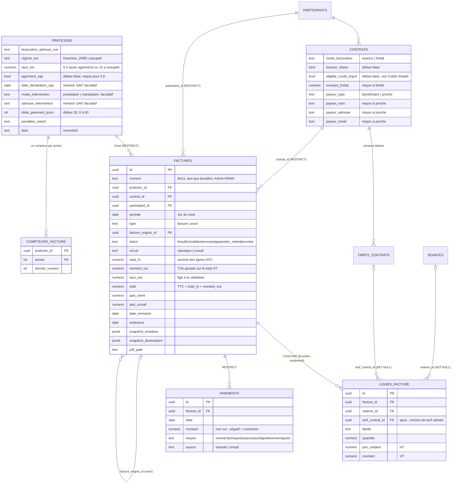

# Facturation — fondations des données (étape 1)

Migrations `20261006100000` à `20261006100400`, tests `tests/db/facturation.spec.ts`.
Aucune route `/api`, aucune interface : uniquement la base et ses garanties.

## Décisions de cadrage

- Le payeur est le bénéficiaire ou un proche, jamais une structure.
- Seules les séances au statut `realisee` sont facturées. Annulées, reportées, planifiées :
  jamais. Pas de statut « absent », pas de règle d'annulation.
- **Les bilans se facturent selon le contrat** (voir « Bilans » plus bas) : par défaut non.
- Chaque praticien émet en son nom, avec sa propre numérotation.
- Une facture émise ne se corrige que par un avoir.

## Modèle



## Cycle de vie d'une facture

1. `generer_brouillon_facture(contrat, mois)` crée ou recalcule le brouillon.
2. `valider_facture(id)` : seul chemin hors du brouillon. Vérifie le profil du
   praticien (SIRET, nom, régime de TVA, adresse) **et l'adresse du bénéficiaire** (rue, code
   postal, ville : mention légale, exigée même quand un proche paie ; IBAN et pénalités
   restent facultatifs), fige émetteur et destinataire
   (snapshots), recalcule le total, attribue le numéro, pose date d'émission et
   échéance, statut `validee`.
3. Ensuite, seuls `statut` et `pdf_path` changent, et des paiements s'ajoutent. Un
   paiement est **immuable** : une correction est une nouvelle ligne de montant négatif.
4. Correction : un avoir (`type = 'avoir'`, montants positifs, le signe est porté par
   le type). S'il annule le total, la facture d'origine passe à `annulee` et libère
   ses séances et le mois.

## Garanties (toutes testées)

| Garantie | Mécanisme |
|---|---|
| Numéro `AAAA-NNNN`, par praticien, remis à 1 chaque année, sans trou, sûr en concurrence | Ligne de `compteurs_facture` incrémentée par `INSERT … ON CONFLICT DO UPDATE` (verrou de ligne tenu jusqu'au commit). Pas de séquence Postgres : non transactionnelle, elle laisserait des trous. |
| Un brouillon, supprimé ou non, ne consomme aucun numéro | Le numéro n'est attribué qu'à la validation. |
| Une seule facture vivante par contrat et par mois | Index unique partiel `factures_une_vivante_par_contrat_periode` (hors `annulee`). |
| Facture validée immuable, non supprimable, sans retour au brouillon | Trigger `factures_inalterables` |
| Paiement immuable, correction par ligne négative sans dépasser l'encaissé | Triggers `paiements_immuables` et `paiements_controle` ; droits UPDATE/DELETE retirés ; policies SELECT + INSERT |
| Pas de facture créée directement validée, pas de faux numéro | Trigger `factures_controle_insertion` + variable locale posée par `valider_facture` |
| Annulation uniquement par avoir total | Variable locale `horizon.annulation_facture` |
| Lignes figées après validation | Trigger `lignes_facture_inalterables` |
| Séance facturée verrouillée (suppression et colonnes de facturation) | Trigger `seances_facturees_inalterables` |
| Version de tarif utilisée verrouillée, sauf clôture | Trigger `tarifs_utilises_inalterables` |
| Un praticien ne voit que ses factures, l'admin lit tout (lecture seule) | RLS |
| Contrat ou bénéficiaire avec factures non supprimable | `ON DELETE RESTRICT` |
| Aucun privilège par défaut sur les nouvelles tables et fonctions | `REVOKE` explicite, puis `GRANT` ciblé |

## Calcul du brouillon

- **Mode séance** : une ligne par séance `realisee` du mois et du contrat (type `seance`, plus
  `bilan` si `contrats.facturer_bilans`, voir « Bilans »), au tarif
  applicable **à la date de la séance**, montant = `tarif_seance + frais_deplacement`.
  Même règle que `trouverTarifApplicable()` / `totalFactureSeance()`
  (`src/lib/tarifsContrats.ts`) ; un test compare les deux. Aucun repli silencieux : une
  séance sans tarif applicable fait échouer la génération en nommant la date.
- **Mode forfait** : une ligne, `montant_forfait`, sans séance. Pas de prorata.
- **Idempotent** : relancée, elle recalcule le même brouillon (jamais un second) ; si la
  facture du mois est déjà émise, elle la renvoie intacte ; s'il n'y a plus rien à
  facturer, le brouillon disparaît et elle renvoie `NULL`.
- Circuit `classique` : `part_client = total` (TTC), `part_urssaf = 0`.

## TVA — hypothèse à confirmer avec l'expert-comptable

> Taux autorisés, agrément et sources : voir « Taux de TVA autorisés » plus bas.

**À valider avant la première facture en régime `assujetti`.** Hypothèse retenue : le prix du
contrat (tarif de séance, frais de déplacement, forfait) est **HT**, et la TVA s'ajoute dessus.

- Les lignes sont en HT. `total_ht` = somme des lignes ; `montant_tva` = `total_ht × taux / 100` ;
  `total` = TTC = `total_ht + montant_tva` ; `part_client + part_urssaf = total` (TTC).
- La TVA est calculée **une fois sur le total HT**, arrondie au centime (pas ligne par ligne :
  3 × 33,33 € HT à 10 % donnent 10,00 € de TVA, contre 9,99 € ligne par ligne).
- `franchise_293B` : taux 0, `total = total_ht`.
- Le taux est figé à la validation (`taux_tva`, et dans le snapshot de l'émetteur). Un brouillon
  annonce le TTC selon le régime du moment ; la validation recalcule avec le régime d'alors.
- Un avoir reprend le taux de sa facture d'origine, même si le régime a changé depuis.
- **À faire valider par l'expert-comptable, en une seule vérification avec le HT/TTC** : l'arrondi
  sur le total, le taux unique par facture, et le cas des services à la personne exonérés
  (art. 261-7-1° du CGI).
- **Décision du 2026-10-07 : pas de troisième régime de TVA pour l'instant.** Le modèle ne connaît
  que `franchise_293B` et `assujetti`. Si l'expert-comptable confirme qu'un praticien SAP relève de
  l'exonération 261-7-1°, il faudra un régime `exonere_sap` (migration + mention sur la facture) :
  d'ici là, ne pas émettre de facture pour un tel praticien en choisissant un des deux régimes
  existants « faute de mieux ».

## Taux de TVA autorisés en régime assujetti

**Règle (étape 2) :** un praticien `assujetti` ne peut avoir que **5,5 %** ou **10 %**, jamais un
taux libre.

| Taux | Cas | Condition dans le modèle |
|---|---|---|
| **5,5 %** | aide essentielle à la vie quotidienne, agrément requis | `praticiens.agrement_sap = true` |
| **10 %** | autres services déclarés | aucune |

- `praticiens.agrement_sap` (booléen, `false` par défaut) est la case du profil de facturation qui
  autorise le 5,5 %. Retirer l'agrément d'un praticien à 5,5 % est refusé tant que son taux n'est pas
  changé.
- `franchise_293B` reste sans taux (vide ou 0). Un `assujetti` sans taux est refusé.
- La même liste fermée (0, 5,5, 10) s'applique à `factures.taux_tva`, et l'agrément du praticien est
  figé dans le snapshot de l'émetteur (`agrement_sap`) au moment de la validation.
- Aucun praticien n'est en régime assujetti aujourd'hui (production et staging : `regime_tva` non
  renseigné) ; la migration échouerait sans rien changer si une ligne existante violait la règle.

**Sources :**
- BOFiP, TVA des services à la personne : <https://bofip.impots.gouv.fr/node/10629>. D'après cette page,
  le taux de 5,5 % vise les services liés aux gestes essentiels de la vie quotidienne de personnes
  handicapées ou âgées dépendantes, avec agrément ; le taux de 10 % vise les autres services listés,
  soumis à déclaration (ou agrément selon l'activité). La page ne mentionne pas le taux de 20 %.
- Mentions de la facture : <https://www.acces-sap.com/actualites/professionnels/facture-services-a-la-personne/>.

**À confirmer avec l'expert-comptable (détail d'application)** :
1. À quel taux relève une séance d'activité physique adaptée à domicile : l'APA relève-t-elle des
   « gestes essentiels de la vie quotidienne » (5,5 %) ou des autres services (10 %) ? Le modèle
   n'en décide pas : il autorise les deux taux, le praticien choisit le sien.
2. Le taux de TVA s'applique-t-il à toute la facture d'un praticien (taux unique par profil), ou
   dépend-il de la prestation ? Le modèle retient un taux unique par facture, celui du profil.
3. L'agrément seul suffit-il pour le 5,5 %, ou faut-il aussi un type d'agrément précis ?
   `agrement_sap` est un simple booléen, sans numéro ni date.
4. L'exonération des services à la personne (art. 261-7-1° du CGI), toujours hors modèle (voir
   « TVA — hypothèse à confirmer »).

## Crédit d'impôt : éligibilité d'un contrat

**Règle générale, pour tous les praticiens de la plateforme (pas propre à un seul) :** un contrat
n'est éligible au crédit d'impôt que si

1. `contrats.eligible_credit_impot = true` (booléen, `false` par défaut), **et**
2. le praticien du contrat a un **n° SAP actif**.

Le champ du contrat est indépendant du statut SAP du praticien : on peut le cocher avant d'obtenir le
n° SAP, il est alors sans effet tant que le n° SAP manque.

- La seule référence est la fonction `contrat_eligible_credit_impot(contrat)` : ne jamais relire
  `eligible_credit_impot` seul. Elle s'exécute avec les droits de l'appelant (la RLS fait foi) et
  renvoie `false` pour un contrat introuvable ou non visible. Le praticien du contrat est celui du
  contrat, à défaut celui du bénéficiaire.
- **« Actif » = un n° SAP renseigné** (non vide, espaces ignorés) sur le profil du praticien : le modèle
  n'a ni date de validité ni statut.
- À la **validation d'une facture**, le résultat est figé dans `snapshot_destinataire`
  (`eligible_credit_impot`). Une facture émise ne se modifie plus : changer ensuite le contrat ou le
  n° SAP ne réécrit pas ce qui a été déclaré.

**Source :** <https://www.acces-sap.com/actualites/professionnels/facture-services-a-la-personne/>.
D'après cette page, seules les prestations figurant parmi les « 26 activités de services à la
personne » ouvrent droit au crédit d'impôt de 50 %, et le numéro et la date d'enregistrement de la
déclaration de services à la personne doivent figurer sur la facture pour justifier l'avantage fiscal
du client.

### Mentions SAP du profil du praticien

La page acces-sap.com (<https://www.acces-sap.com/actualites/professionnels/facture-services-a-la-personne/>)
liste les mentions d'une facture de services à la personne, parmi lesquelles « le numéro et la date
d'enregistrement de la déclaration de services à la personne » de l'émetteur, le « mode d'intervention »
(prestataire ou mandataire) et l'adresse d'exécution. Trois colonnes simples, toutes facultatives, ont donc
été ajoutées au profil de facturation (`praticiens`), à côté de `numero_sap` :

| Colonne | Type | Valeurs |
|---|---|---|
| `date_declaration_sap` | date | date d'enregistrement de la déclaration SAP |
| `mode_intervention` | texte | `prestataire` ou `mandataire`, ou vide |
| `adresse_intervention` | texte libre | adresse d'intervention |

- **Pas de statut ni de date de fin pour l'instant** (décision du 2026-10-05) : « actif » reste « n° SAP
  non vide » et **ne dépend pas** de `date_declaration_sap`. Une date seule, sans n° SAP, ne rend pas un
  contrat éligible.
- Les trois valeurs sont figées dans `snapshot_emetteur` à la validation, comme le reste du profil.
- Rien ne les **rend obligatoires** à la validation : un profil sans ces mentions valide quand même.

**À confirmer avec l'expert-comptable (détail d'application)** :
1. L'activité physique adaptée figure-t-elle parmi les 26 activités ? L'éligibilité d'une prestation
   dépend de l'activité, pas seulement du praticien : le champ du contrat est la décision du
   praticien, rien ne la vérifie.
2. Ces trois mentions doivent-elles être **exigées** à la validation d'une facture portant sur un contrat
   éligible (n° SAP, date de déclaration, mode d'intervention) ? Aujourd'hui, non.
3. `adresse_intervention` est une valeur **du profil du praticien**. La source parle des adresses du client
   (facturation et exécution) : l'adresse où la séance a lieu est celle du bénéficiaire (déjà portée par la
   séance). À préciser si la mention attendue est celle du praticien ou celle de chaque intervention.
4. Faut-il aussi bloquer la coche du contrat quand le praticien n'a pas de n° SAP, plutôt que de la
   laisser sans effet ? Le choix actuel évite de forcer l'ordre de saisie.

## Bilans : une règle par contrat

Décision du praticien référent (2026-10-08) : facturer ou non un bilan dépend du praticien. Certains
le facturent comme une séance normale, d'autres non. La règle se porte donc sur le contrat :
`contrats.facturer_bilans` (booléen, `false` par défaut, aucun contrat existant ne change).

| `facturer_bilans` | Séances facturées par `generer_brouillon_facture()` |
|---|---|
| `false` (défaut) | type `seance` uniquement |
| `true` | type `seance` **et** type `bilan` |

Quand il est vrai, un bilan réalisé est facturé **au même tarif que les séances** : tarif applicable
à sa date dans `tarifs_contrats`, sans distinction de durée ni tarif séparé. Sa ligne se libelle
« Bilan du … » au lieu de « Séance du … » pour que la facture dise ce qu'elle facture ; le montant est
celui d'une séance.

Dans tous les cas :

- seul le statut `realisee` compte : un bilan annulé, reporté ou planifié n'est jamais facturé ;
- **`bilan_initial` reste exclu** : la décision ne vise que le type `bilan`. À confirmer avec le
  praticien référent si le bilan initial doit suivre la même règle ;
- une séance sans tarif applicable fait échouer la génération, bilan compris quand il est facturé ;
- une facture déjà émise ne change plus, quelle que soit la valeur de `facturer_bilans` ensuite ; un
  brouillon se recalcule avec la valeur du moment ;
- un bilan facturé est verrouillé comme une séance facturée.

## Décisions de sécurité et d'interface

- **L'admin lit toutes les factures, lignes de facture et paiements, en lecture seule, par la RLS.**
  C'est une **exigence voulue** (décision du 2026-10-05 : « admin lecture seule sur tout »), **pas une
  faille**. Trois policies `*_admin_lecture` (`FOR SELECT TO authenticated`, conditionnées à
  `app_role_courant() = 'admin'`) la portent. L'admin n'écrit rien par ce canal.
- Le harnais de sécurité (`tests/security/rls.spec.ts`) interdisait toute policy fondée sur le rôle,
  en annonçant qu'il serait remplacé le jour où les rôles seraient branchés. Il est désormais une **liste
  blanche fermée** : seules ces 3 policies (plus, depuis l'étape 5, la lecture admin des PDF sur
  `storage.objects`, soit 4 au total) sont permises, elles doivent rester en lecture seule, réservées
  à `authenticated` et conditionnées à `admin` exactement. Toute autre policy fondée sur le rôle fait
  échouer le test.
- Les tables `factures`, `lignes_facture`, `paiements` et `compteurs_facture` sont déclarées dans la liste
  d'exclusion du harnais, avec leur raison : vides en staging (aucune interface), donc le test générique
  ferait un « skip » compté comme échec. Leur cloisonnement est testé sur une vraie base par
  `tests/db/facturation.spec.ts`. À réintégrer au test générique quand staging contiendra de vraies factures.
- **Ancienne ébauche de facturation (`factures_suivi`) masquée de l'interface le 2026-10-05**, sur la page
  Stats **et** sur la fiche structure (décision confirmée : « garde la carte masquée, comme pour Stats »).
  Le code et la table sont conservés derrière l'interrupteur `EBAUCHE_FACTURATION_VISIBLE`
  (`src/lib/featuresFacturation.ts`). Le portail structure continue d'afficher en lecture seule les lignes
  existantes de `factures_suivi` (la table est vide en production).
- **L'éligibilité au crédit d'impôt et l'agrément sont figés dans la facture** à la validation
  (`snapshot_destinataire.eligible_credit_impot`, `snapshot_emetteur.agrement_sap`) : décision du
  2026-10-05, à garder tel quel.

## Facture progressive (2026-10-09)

Le brouillon du mois se construit **au fil des séances réalisées** : au 1er du mois, Pierre ouvre un
brouillon déjà complet, le relit, puis le valide. Migration `20261011100000_facturation_progressive.sql`,
tests `tests/db/facturation-progressive.spec.ts`.

- **Trigger sur `seances`** (`seances_recalcul_brouillon`, 3 triggers INSERT / UPDATE / DELETE) : une séance
  qui entre dans « réalisée », en sort, change de contrat, de date, d'heure ou de type rappelle
  `generer_brouillon_facture` pour l'ancien et le nouveau (contrat, mois). Même logique que le cron :
  contrat à la séance, statut actif / terminé / suspendu, dates recouvrant le mois. Pas de brouillon pour un
  mois futur, ni pour un forfait. `SECURITY DEFINER` : le praticien, une route `service_role` ou le cron
  produisent le même résultat.
- **Trigger sur `tarifs_contrats`** (`tarifs_recalcul_brouillons`) : créer, modifier ou supprimer une version de
  tarif recalcule tous les mois où le contrat a des séances réalisées dans la plage de validité. C'est ce qui
  fait de « corriger le tarif » le bon geste, et ce qui rattrape une séance saisie avant son tarif.
- **Les erreurs sont avalées** : une séance sans tarif applicable ne doit jamais empêcher la saisie. Le
  brouillon reste alors tel quel (périmé), la séance est enregistrée, et le cron du 1er recalcule et journalise
  l'erreur (`[facturation] contrat … : Aucun tarif applicable…`).
- **Le brouillon est le reflet automatique des séances.** Un recalcul reconstruit ses lignes : il n'existe donc
  aucun champ montant libre. On corrige en éditant **la séance ou le tarif**, jamais la facture.
- **Une facture émise n'est jamais touchée** : `generer_brouillon_facture` la renvoie telle quelle. Limite
  connue, antérieure : une séance réalisée APRÈS la validation de la facture du mois n'est facturée nulle part
  (une seule facture vivante par contrat et par mois).
- **Validation à partir du 1er du mois suivant** : le trigger `factures_validation_apres_le_mois` refuse le
  passage brouillon → validée d'une facture avant le 1er du mois suivant son mois de prestation (date civile
  Paris), avec le message « Facture de MM/AAAA : validation possible à partir du JJ/MM/AAAA ». Il refuse aussi le
  `service_role` et ne consomme aucun numéro (l'exception annule la transaction). Les avoirs en sont exclus. La
  règle est un trigger et non un test dans `valider_facture` : cette fonction a été redéfinie en entier à chaque
  étape, et une garde copiée dans son corps se perdrait à la prochaine redéfinition.
- **Cron du 1er** : recalcule les brouillons du mois écoulé, puis notifie. « N factures à valider » part pour les
  brouillons créés par l'exécution, et le 1er du mois (date Paris) pour tous les brouillons du mois écoulé. Les
  autres jours, le recalcul ne renvoie pas le même push. Si le cron saute le 1er, seuls les brouillons créés sont
  notifiés : l'écran reste la source de vérité.
- **Écran « Factures à valider »** : les brouillons dont le mois est terminé restent validables (une à une ou
  « Tout valider »). Une section « En cours » montre, en lecture seule, le brouillon du mois courant avec son total
  « à ce jour » et la date d'ouverture de la validation. Même règle côté interface (`estValidable`,
  `src/lib/facturesAValider.ts`), mais la base reste seule juge.

## Génération et écrans praticien (étapes 3 et 4)

- **Génération** : voir « Facture progressive » ci-dessous. La tâche `facturation` de `/api/cron/rappels`
  s'exécute chaque jour à 5h UTC, ne traite que le mois précédent, crée les brouillons qui manquent et
  recalcule ceux qui existent (une facture émise n'est jamais touchée). Un cron manqué le 1er est donc
  rattrapé le lendemain. Un brouillon supprimé ou une facture annulée est régénéré au passage suivant.
  Code : `api/_lib/facturationMensuelle.ts`.
- **« Factures à valider »** (`/factures/a-valider`) puis **« Factures validées »** (`/factures`) :
  validation par `supabase.rpc('valider_facture')` sous la RLS, aucune route `/api`.
- **Profil de facturation** (`/settings/facturation`, lien depuis Paramètres) : formulaire lu et
  écrit directement sur `praticiens` sous la RLS (`id = auth.uid()`). Il n'écrit que les colonnes de
  facturation : régime de TVA et taux, agrément SAP, date de déclaration, mode et adresse
  d'intervention, adresse de facturation, IBAN, délai de paiement, pénalités. L'identité (SIRET,
  nom, n° SAP, n° TVA, adresse professionnelle) reste éditée dans Paramètres et n'est que rappelée.
  Logique pure : `src/lib/profilFacturation.ts`.

**Obligatoire pour valider une facture** (lu dans `valider_facture`, pas supposé) : SIRET, nom,
régime de TVA, et une adresse complète prise dans `facturation_*` champ par champ, à défaut dans
`adresse_*`. Tout le reste (IBAN, pénalités, agrément, mentions SAP) est facultatif. L'écran affiche
ce qui manque AVANT l'enregistrement, et un test de base réelle vérifie que ce bandeau annonce
exactement les manques que le serveur signalerait.

**Piège d'adresse** : le serveur fait `coalesce(facturation_x, adresse_x)`, donc ne retombe sur
l'adresse du profil que si la valeur de facturation est NULL, pas si elle est vide. Le formulaire
enregistre toujours NULL pour un champ vide, jamais `''`.

Contraintes de TVA reproduites par l'interface (la base reste seule juge) : assujetti = 10 %, ou
5,5 % avec agrément ; franchise = pas de taux. Retirer l'agrément alors que 5,5 % est choisi remet
le taux à choisir.

## PDF et stockage (étape 5, PR A)

Une facture validée reçoit son PDF automatiquement. L'envoi par e-mail (pièce jointe, journal, reprise)
est la PR B.

```
valider_facture()  ->  trigger AFTER UPDATE (brouillon -> validee)
                       -> pg_net (au COMMIT, asynchrone)
                       -> Edge Function `facturation-pdf`
                       -> bucket privé `factures` : {praticien_id}/{numero}.pdf
                       -> factures.pdf_path
```

- **Contenu figé** : le PDF est composé uniquement depuis `factures`, `lignes_facture` et les deux
  snapshots. Rien n'est relu dans le profil, rien n'est recalculé (la TVA reste arrondie une fois sur le
  total HT). Code pur et testé : `supabase/functions/facturation-pdf/composer.ts` (`pdf-lib`).
- **Reproductible** : métadonnées fixées sur la date d'émission, pas d'object streams ; le spike du
  2026-10-08 sur l'Edge runtime de staging a donné le même sha256 d'un appel à l'autre. La régénération
  « à l'identique » est donc possible, et ne se fait que si `pdf_path` est vide. Un fichier existant n'est
  **jamais écrasé** : s'il diffère de la recomposition, la fonction le journalise et garde l'existant.
- **Mentions** : identité et SIRET du praticien, n° et date de déclaration SAP, mode et adresse
  d'intervention (s'ils sont renseignés), payeur et, si c'est un proche, rappel du bénéficiaire avec
  son adresse, lignes, HT / TVA / TTC (ou « TVA non applicable, art. 293 B du CGI » en franchise),
  échéance, virement et IBAN. Un avoir est titré « Avoir » et cite la facture d'origine (structure
  seulement : la création d'avoirs n'est pas dans l'étape 5).
- **Volontairement absent** : toute répartition client / URSSAF (V1 : 100 % au payeur, circuit URSSAF
  hors périmètre) ; les pénalités de retard (payeurs particuliers uniquement, aucune facture B2B) ; la
  phrase sur l'avantage fiscal, tant que l'expert-comptable n'a pas confirmé l'éligibilité des activités
  (voir « Crédit d'impôt »).
- **Stockage** : bucket `factures` privé, PDF seul, 5 Mo. Lecture par RLS sur `storage.objects` : le
  praticien lit son dossier, l'admin lit tout (décision du 2026-10-08, même principe que les factures).
  **Aucune policy d'écriture** : seul `service_role` (l'Edge Function) crée un fichier ; personne ne le
  remplace ni ne le supprime par l'API. Téléchargement depuis « Factures validées » sous la session du
  praticien, sans route `/api` ni lien durable.
- **La validation ne dépend jamais du PDF** : pg_net n'émet qu'au commit, et le trigger avale toute
  erreur. Sans PDF, la liste affiche « PDF en préparation ».

### Mise en service d'un environnement (à faire à la main, jamais dans une migration)

1. `supabase secrets set FACTURATION_WEBHOOK_SECRET=<aléatoire long> --project-ref <ref>`.
2. `supabase functions deploy facturation-pdf --project-ref <ref>` : **toujours avec `--project-ref`
   explicite**, le dépôt est lié à la production.
3. Dans Vault de la base du même projet :
   `select vault.create_secret('https://<ref>.supabase.co/functions/v1/facturation-pdf', 'facturation_pdf_url');`
   et `select vault.create_secret('<le même secret>', 'facturation_webhook_secret');`.

Tant que les deux secrets Vault manquent, le trigger ne fait rien.

## Lancer les tests

```bash
supabase start && supabase db reset
npm run test:db
```

Base **locale uniquement** (le fichier refuse tout autre hôte), hors CI. Les tests
commitent des factures validées pour vérifier la concurrence ; elles sont
inaltérables, donc elles restent jusqu'au prochain `supabase db reset`.

## Visible côté praticien (à traiter à l'étape suivante)

Une séance déjà facturée ne peut plus changer de date, d'heure, de durée, de
contrat ni de statut, ni être supprimée. L'agenda affichera une erreur tant que
l'interface n'explique pas ce verrou. Les autres colonnes (notes, adresse…) restent
modifiables.
