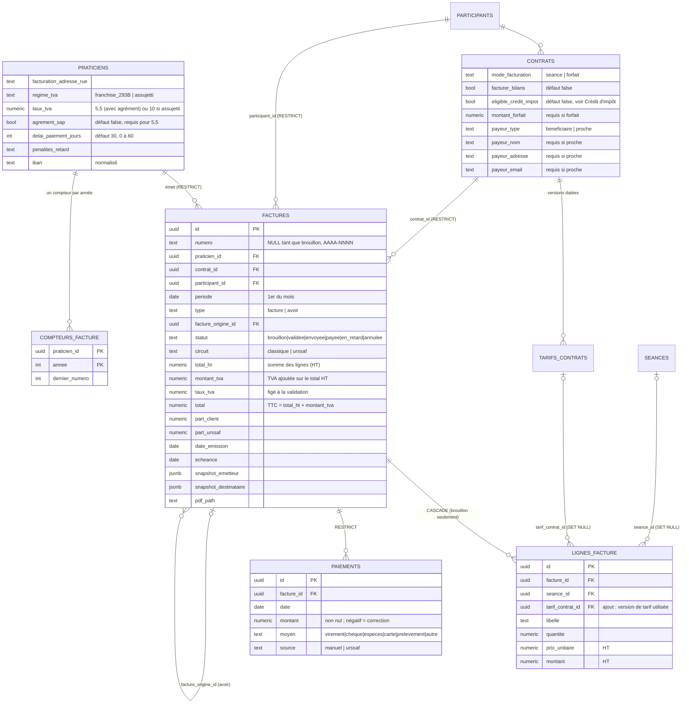

# Facturation — fondations des données (étape 1)

Migrations `20261006100000` à `20261006100400`, tests `tests/db/facturation.spec.ts`.
Aucune route `/api`, aucune interface : uniquement la base et ses garanties.

## Décisions de cadrage

- Le payeur est le bénéficiaire ou un proche, jamais une structure.
- Seules les séances au statut `realisee` sont facturées. Annulées, reportées, planifiées :
  jamais. Pas de statut « absent », pas de règle d'annulation.
- **Les bilans se facturent selon le contrat** (voir « Bilans » plus bas) : par défaut non.
- Chaque praticien émet en son nom, avec sa propre numérotation.
- Une facture émise ne se corrige que par un avoir.

## Modèle



## Cycle de vie d'une facture

1. `generer_brouillon_facture(contrat, mois)` crée ou recalcule le brouillon.
2. `valider_facture(id)` : seul chemin hors du brouillon. Vérifie le profil du
   praticien (SIRET, nom, régime de TVA, adresse) **et l'adresse du bénéficiaire** (rue, code
   postal, ville : mention légale, exigée même quand un proche paie ; IBAN et pénalités
   restent facultatifs), fige émetteur et destinataire
   (snapshots), recalcule le total, attribue le numéro, pose date d'émission et
   échéance, statut `validee`.
3. Ensuite, seuls `statut` et `pdf_path` changent, et des paiements s'ajoutent. Un
   paiement est **immuable** : une correction est une nouvelle ligne de montant négatif.
4. Correction : un avoir (`type = 'avoir'`, montants positifs, le signe est porté par
   le type). S'il annule le total, la facture d'origine passe à `annulee` et libère
   ses séances et le mois.

## Garanties (toutes testées)

| Garantie | Mécanisme |
|---|---|
| Numéro `AAAA-NNNN`, par praticien, remis à 1 chaque année, sans trou, sûr en concurrence | Ligne de `compteurs_facture` incrémentée par `INSERT … ON CONFLICT DO UPDATE` (verrou de ligne tenu jusqu'au commit). Pas de séquence Postgres : non transactionnelle, elle laisserait des trous. |
| Un brouillon, supprimé ou non, ne consomme aucun numéro | Le numéro n'est attribué qu'à la validation. |
| Une seule facture vivante par contrat et par mois | Index unique partiel `factures_une_vivante_par_contrat_periode` (hors `annulee`). |
| Facture validée immuable, non supprimable, sans retour au brouillon | Trigger `factures_inalterables` |
| Paiement immuable, correction par ligne négative sans dépasser l'encaissé | Triggers `paiements_immuables` et `paiements_controle` ; droits UPDATE/DELETE retirés ; policies SELECT + INSERT |
| Pas de facture créée directement validée, pas de faux numéro | Trigger `factures_controle_insertion` + variable locale posée par `valider_facture` |
| Annulation uniquement par avoir total | Variable locale `horizon.annulation_facture` |
| Lignes figées après validation | Trigger `lignes_facture_inalterables` |
| Séance facturée verrouillée (suppression et colonnes de facturation) | Trigger `seances_facturees_inalterables` |
| Version de tarif utilisée verrouillée, sauf clôture | Trigger `tarifs_utilises_inalterables` |
| Un praticien ne voit que ses factures, l'admin lit tout (lecture seule) | RLS |
| Contrat ou bénéficiaire avec factures non supprimable | `ON DELETE RESTRICT` |
| Aucun privilège par défaut sur les nouvelles tables et fonctions | `REVOKE` explicite, puis `GRANT` ciblé |

## Calcul du brouillon

- **Mode séance** : une ligne par séance `realisee` du mois et du contrat (type `seance`, plus
  `bilan` si `contrats.facturer_bilans`, voir « Bilans »), au tarif
  applicable **à la date de la séance**, montant = `tarif_seance + frais_deplacement`.
  Même règle que `trouverTarifApplicable()` / `totalFactureSeance()`
  (`src/lib/tarifsContrats.ts`) ; un test compare les deux. Aucun repli silencieux : une
  séance sans tarif applicable fait échouer la génération en nommant la date.
- **Mode forfait** : une ligne, `montant_forfait`, sans séance. Pas de prorata.
- **Idempotent** : relancée, elle recalcule le même brouillon (jamais un second) ; si la
  facture du mois est déjà émise, elle la renvoie intacte ; s'il n'y a plus rien à
  facturer, le brouillon disparaît et elle renvoie `NULL`.
- Circuit `classique` : `part_client = total` (TTC), `part_urssaf = 0`.

## TVA — hypothèse à confirmer avec l'expert-comptable

> Taux autorisés, agrément et sources : voir « Taux de TVA autorisés » plus bas.

**À valider avant la première facture en régime `assujetti`.** Hypothèse retenue : le prix du
contrat (tarif de séance, frais de déplacement, forfait) est **HT**, et la TVA s'ajoute dessus.

- Les lignes sont en HT. `total_ht` = somme des lignes ; `montant_tva` = `total_ht × taux / 100` ;
  `total` = TTC = `total_ht + montant_tva` ; `part_client + part_urssaf = total` (TTC).
- La TVA est calculée **une fois sur le total HT**, arrondie au centime (pas ligne par ligne :
  3 × 33,33 € HT à 10 % donnent 10,00 € de TVA, contre 9,99 € ligne par ligne).
- `franchise_293B` : taux 0, `total = total_ht`.
- Le taux est figé à la validation (`taux_tva`, et dans le snapshot de l'émetteur). Un brouillon
  annonce le TTC selon le régime du moment ; la validation recalcule avec le régime d'alors.
- Un avoir reprend le taux de sa facture d'origine, même si le régime a changé depuis.
- **À faire valider par l'expert-comptable, en une seule vérification avec le HT/TTC** : l'arrondi
  sur le total, le taux unique par facture, et le cas des services à la personne exonérés
  (art. 261-7-1° du CGI).
- **Décision du 2026-10-07 : pas de troisième régime de TVA pour l'instant.** Le modèle ne connaît
  que `franchise_293B` et `assujetti`. Si l'expert-comptable confirme qu'un praticien SAP relève de
  l'exonération 261-7-1°, il faudra un régime `exonere_sap` (migration + mention sur la facture) :
  d'ici là, ne pas émettre de facture pour un tel praticien en choisissant un des deux régimes
  existants « faute de mieux ».

## Taux de TVA autorisés en régime assujetti

**Règle (étape 2) :** un praticien `assujetti` ne peut avoir que **5,5 %** ou **10 %**, jamais un
taux libre.

| Taux | Cas | Condition dans le modèle |
|---|---|---|
| **5,5 %** | aide essentielle à la vie quotidienne, agrément requis | `praticiens.agrement_sap = true` |
| **10 %** | autres services déclarés | aucune |

- `praticiens.agrement_sap` (booléen, `false` par défaut) est la case du profil de facturation qui
  autorise le 5,5 %. Retirer l'agrément d'un praticien à 5,5 % est refusé tant que son taux n'est pas
  changé.
- `franchise_293B` reste sans taux (vide ou 0). Un `assujetti` sans taux est refusé.
- La même liste fermée (0, 5,5, 10) s'applique à `factures.taux_tva`, et l'agrément du praticien est
  figé dans le snapshot de l'émetteur (`agrement_sap`) au moment de la validation.
- Aucun praticien n'est en régime assujetti aujourd'hui (production et staging : `regime_tva` non
  renseigné) ; la migration échouerait sans rien changer si une ligne existante violait la règle.

**Sources :**
- BOFiP, TVA des services à la personne : <https://bofip.impots.gouv.fr/node/10629>. D'après cette page,
  le taux de 5,5 % vise les services liés aux gestes essentiels de la vie quotidienne de personnes
  handicapées ou âgées dépendantes, avec agrément ; le taux de 10 % vise les autres services listés,
  soumis à déclaration (ou agrément selon l'activité). La page ne mentionne pas le taux de 20 %.
- Mentions de la facture : <https://www.acces-sap.com/actualites/professionnels/facture-services-a-la-personne/>.

**À confirmer avec l'expert-comptable (détail d'application)** :
1. À quel taux relève une séance d'activité physique adaptée à domicile : l'APA relève-t-elle des
   « gestes essentiels de la vie quotidienne » (5,5 %) ou des autres services (10 %) ? Le modèle
   n'en décide pas : il autorise les deux taux, le praticien choisit le sien.
2. Le taux de TVA s'applique-t-il à toute la facture d'un praticien (taux unique par profil), ou
   dépend-il de la prestation ? Le modèle retient un taux unique par facture, celui du profil.
3. L'agrément seul suffit-il pour le 5,5 %, ou faut-il aussi un type d'agrément précis ?
   `agrement_sap` est un simple booléen, sans numéro ni date.
4. L'exonération des services à la personne (art. 261-7-1° du CGI), toujours hors modèle (voir
   « TVA — hypothèse à confirmer »).

## Crédit d'impôt : éligibilité d'un contrat

**Règle générale, pour tous les praticiens de la plateforme (pas propre à un seul) :** un contrat
n'est éligible au crédit d'impôt que si

1. `contrats.eligible_credit_impot = true` (booléen, `false` par défaut), **et**
2. le praticien du contrat a un **n° SAP actif**.

Le champ du contrat est indépendant du statut SAP du praticien : on peut le cocher avant d'obtenir le
n° SAP, il est alors sans effet tant que le n° SAP manque.

- La seule référence est la fonction `contrat_eligible_credit_impot(contrat)` : ne jamais relire
  `eligible_credit_impot` seul. Elle s'exécute avec les droits de l'appelant (la RLS fait foi) et
  renvoie `false` pour un contrat introuvable ou non visible. Le praticien du contrat est celui du
  contrat, à défaut celui du bénéficiaire.
- **« Actif » = un n° SAP renseigné** (non vide, espaces ignorés) sur le profil du praticien : le modèle
  n'a ni date de validité ni statut.
- À la **validation d'une facture**, le résultat est figé dans `snapshot_destinataire`
  (`eligible_credit_impot`). Une facture émise ne se modifie plus : changer ensuite le contrat ou le
  n° SAP ne réécrit pas ce qui a été déclaré.

**Source :** <https://www.acces-sap.com/actualites/professionnels/facture-services-a-la-personne/>.
D'après cette page, seules les prestations figurant parmi les « 26 activités de services à la
personne » ouvrent droit au crédit d'impôt de 50 %, et le numéro et la date d'enregistrement de la
déclaration de services à la personne doivent figurer sur la facture pour justifier l'avantage fiscal
du client.

**À confirmer avec l'expert-comptable (détail d'application)** :
1. L'activité physique adaptée figure-t-elle parmi les 26 activités ? L'éligibilité d'une prestation
   dépend de l'activité, pas seulement du praticien : le champ du contrat est la décision du
   praticien, rien ne la vérifie.
2. **La date d'enregistrement de la déclaration SAP n'est pas stockée.** La page citée l'exige sur la
   facture ; le modèle n'a que `numero_sap`. Il faudra l'ajouter (`date_declaration_sap`) avant la
   première facture destinée à ouvrir droit au crédit d'impôt, et décider si « actif » doit alors
   tenir compte d'une date de fin.
3. Les autres mentions citées par la page et absentes du modèle actuel : le mode d'intervention
   (prestataire ou mandataire) et l'adresse d'intervention (distincte de l'adresse de facturation).
4. Faut-il aussi bloquer la coche du contrat quand le praticien n'a pas de n° SAP, plutôt que de la
   laisser sans effet ? Le choix actuel évite de forcer l'ordre de saisie.

## Bilans : une règle par contrat

Décision du praticien référent (2026-10-08) : facturer ou non un bilan dépend du praticien. Certains
le facturent comme une séance normale, d'autres non. La règle se porte donc sur le contrat :
`contrats.facturer_bilans` (booléen, `false` par défaut, aucun contrat existant ne change).

| `facturer_bilans` | Séances facturées par `generer_brouillon_facture()` |
|---|---|
| `false` (défaut) | type `seance` uniquement |
| `true` | type `seance` **et** type `bilan` |

Quand il est vrai, un bilan réalisé est facturé **au même tarif que les séances** : tarif applicable
à sa date dans `tarifs_contrats`, sans distinction de durée ni tarif séparé. Sa ligne se libelle
« Bilan du … » au lieu de « Séance du … » pour que la facture dise ce qu'elle facture ; le montant est
celui d'une séance.

Dans tous les cas :

- seul le statut `realisee` compte : un bilan annulé, reporté ou planifié n'est jamais facturé ;
- **`bilan_initial` reste exclu** : la décision ne vise que le type `bilan`. À confirmer avec le
  praticien référent si le bilan initial doit suivre la même règle ;
- une séance sans tarif applicable fait échouer la génération, bilan compris quand il est facturé ;
- une facture déjà émise ne change plus, quelle que soit la valeur de `facturer_bilans` ensuite ; un
  brouillon se recalcule avec la valeur du moment ;
- un bilan facturé est verrouillé comme une séance facturée.

## Lancer les tests

```bash
supabase start && supabase db reset
npm run test:db
```

Base **locale uniquement** (le fichier refuse tout autre hôte), hors CI. Les tests
commitent des factures validées pour vérifier la concurrence ; elles sont
inaltérables, donc elles restent jusqu'au prochain `supabase db reset`.

## Visible côté praticien (à traiter à l'étape suivante)

Une séance déjà facturée ne peut plus changer de date, d'heure, de durée, de
contrat ni de statut, ni être supprimée. L'agenda affichera une erreur tant que
l'interface n'explique pas ce verrou. Les autres colonnes (notes, adresse…) restent
modifiables.
