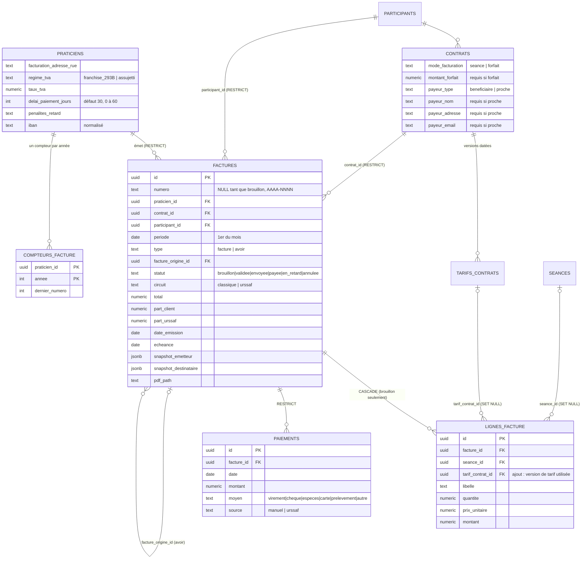

# Facturation — fondations des données (étape 1)

Migrations `20261006100000` à `20261006100400`, tests `tests/db/facturation.spec.ts`.
Aucune route `/api`, aucune interface : uniquement la base et ses garanties.

## Décisions de cadrage

- Le payeur est le bénéficiaire ou un proche, jamais une structure.
- Seules les séances au statut `realisee` sont facturées. Annulées, reportées,
  planifiées : jamais. Pas de statut « absent », pas de règle d'annulation.
- Chaque praticien émet en son nom, avec sa propre numérotation.
- Une facture émise ne se corrige que par un avoir.

## Modèle



## Cycle de vie d'une facture

1. `generer_brouillon_facture(contrat, mois)` crée ou recalcule le brouillon.
2. `valider_facture(id)` : seul chemin hors du brouillon. Vérifie le profil du
   praticien (SIRET, nom, régime de TVA, adresse), fige émetteur et destinataire
   (snapshots), recalcule le total, attribue le numéro, pose date d'émission et
   échéance, statut `validee`.
3. Ensuite, seuls `statut` et `pdf_path` changent, et des paiements s'ajoutent.
4. Correction : un avoir (`type = 'avoir'`, montants positifs, le signe est porté par
   le type). S'il annule le total, la facture d'origine passe à `annulee` et libère
   ses séances et le mois.

## Garanties (toutes testées)

| Garantie | Mécanisme |
|---|---|
| Numéro `AAAA-NNNN`, par praticien, remis à 1 chaque année, sans trou, sûr en concurrence | Ligne de `compteurs_facture` incrémentée par `INSERT … ON CONFLICT DO UPDATE` (verrou de ligne tenu jusqu'au commit). Pas de séquence Postgres : non transactionnelle, elle laisserait des trous. |
| Un brouillon, supprimé ou non, ne consomme aucun numéro | Le numéro n'est attribué qu'à la validation. |
| Une seule facture vivante par contrat et par mois | Index unique partiel `factures_une_vivante_par_contrat_periode` (hors `annulee`). |
| Facture validée immuable, non supprimable, sans retour au brouillon | Trigger `factures_inalterables` |
| Pas de facture créée directement validée, pas de faux numéro | Trigger `factures_controle_insertion` + variable locale posée par `valider_facture` |
| Annulation uniquement par avoir total | Variable locale `horizon.annulation_facture` |
| Lignes figées après validation | Trigger `lignes_facture_inalterables` |
| Séance facturée verrouillée (suppression et colonnes de facturation) | Trigger `seances_facturees_inalterables` |
| Version de tarif utilisée verrouillée, sauf clôture | Trigger `tarifs_utilises_inalterables` |
| Un praticien ne voit que ses factures, l'admin lit tout (lecture seule) | RLS |
| Contrat ou bénéficiaire avec factures non supprimable | `ON DELETE RESTRICT` |
| Aucun privilège par défaut sur les nouvelles tables et fonctions | `REVOKE` explicite, puis `GRANT` ciblé |

## Calcul du brouillon

- **Mode séance** : une ligne par séance `realisee` du mois et du contrat, au tarif
  applicable **à la date de la séance**, montant = `tarif_seance + frais_deplacement`.
  Même règle que `trouverTarifApplicable()` / `totalFactureSeance()`
  (`src/lib/tarifsContrats.ts`) ; un test compare les deux. Aucun repli silencieux : une
  séance sans tarif applicable fait échouer la génération en nommant la date.
- **Mode forfait** : une ligne, `montant_forfait`, sans séance. Pas de prorata.
- **Idempotent** : relancée, elle recalcule le même brouillon (jamais un second) ; si la
  facture du mois est déjà émise, elle la renvoie intacte ; s'il n'y a plus rien à
  facturer, le brouillon disparaît et elle renvoie `NULL`.
- Circuit `classique` : `part_client = total`, `part_urssaf = 0`.

## Lancer les tests

```bash
supabase start && supabase db reset
npm run test:db
```

Base **locale uniquement** (le fichier refuse tout autre hôte), hors CI. Les tests
commitent des factures validées pour vérifier la concurrence ; elles sont
inaltérables, donc elles restent jusqu'au prochain `supabase db reset`.

## Visible côté praticien (à traiter à l'étape suivante)

Une séance déjà facturée ne peut plus changer de date, d'heure, de durée, de
contrat ni de statut, ni être supprimée. L'agenda affichera une erreur tant que
l'interface n'explique pas ce verrou. Les autres colonnes (notes, adresse…) restent
modifiables.
